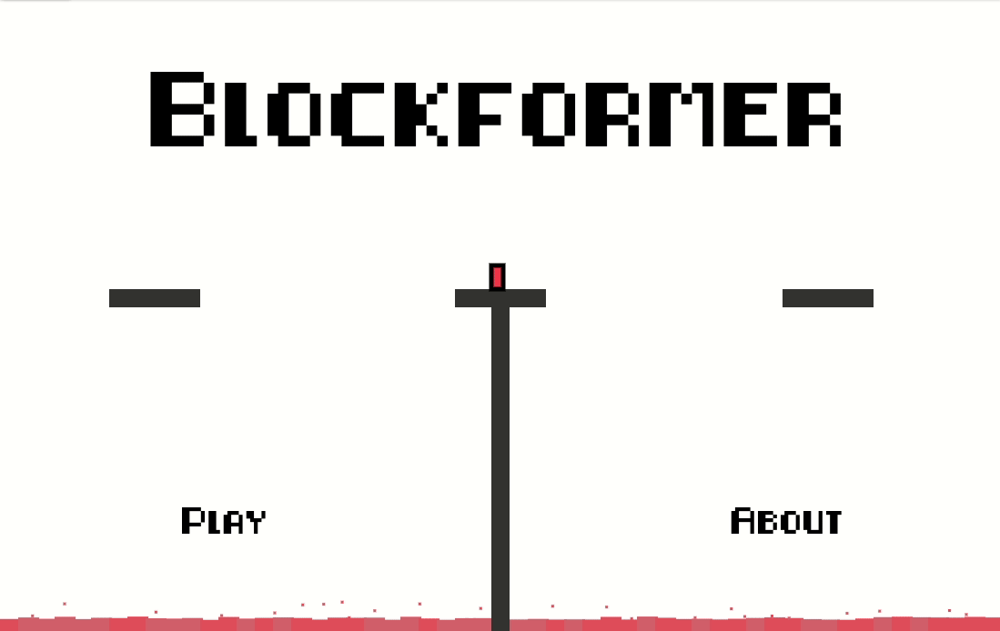

# Blockformer

Blockformer is a 2D platformer game made with JavaScript and the [HTML canvas element](https://en.wikipedia.org/wiki/Canvas_element). Players of the game maneuver through seas of lava, falling platforms, turrets and trampolines in 9 engaging levels!

Play Blockformer here: 
### https://edweenie123.github.io/blockformer/

## Demo


## More About the Game
Blockformer was made in collaboration with 4 kids from a local elementary school. Through several meetings, I would synthesize their ideas to program additional features for the game.

## Installation
To run Blockformer locally:
1. Clone the project repository
	```sh
	git clone https://github.com/edweenie123/blockformer.git 
	```
2. Open `index.html` with a web browser (preferably Chrome or Firefox)
